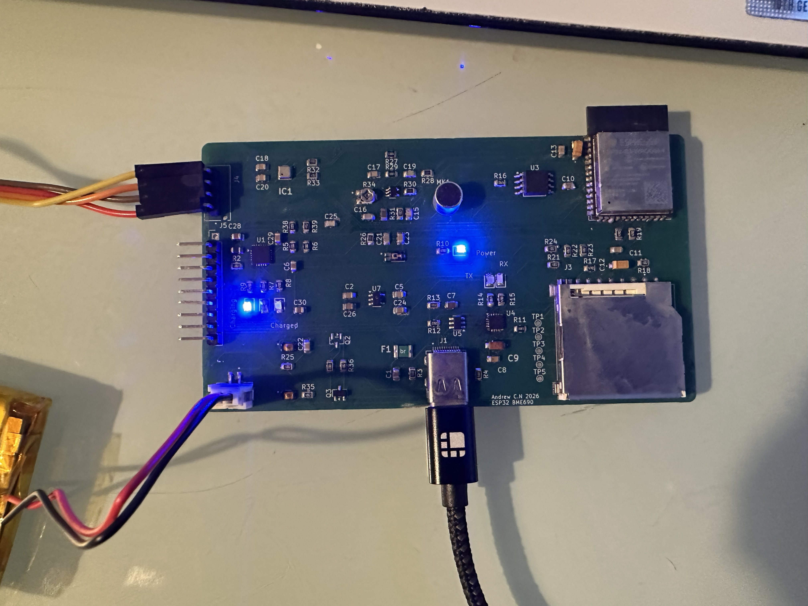

# ESP32_BME690

Multi-room ESP32-S3 environmental sensor node that streams air-quality data
to a Node.js server over Wi-Fi. Built around the Bosch BME690 with auxiliary
light, sound and battery monitoring.



## Hardware

- ESP32-S3-WROOM-1 module
- Bosch **BME690** (I2C) — temperature, humidity, pressure, IAQ, CO2eq, bVOC
- SH1106 0.96" OLED (I2C)
- TEMT6000 ambient light sensor
- Analog MEMS microphone (sound level)
- 1-cell LiPo with 1M/1M voltage divider on the battery rail
- USB-C power / programming
- Status LED

KiCad project lives in [hardware/kicad/](hardware/kicad/).

### Pin map

| Function    | GPIO |
|-------------|------|
| I2C SDA     | 8    |
| I2C SCL     | 9    |
| Status LED  | 2    |
| Light sensor (TEMT6000) | 5 |
| Microphone  | 4    |
| VBAT sense  | 1    |

## Firmware

Sketches live in [firmware/](firmware/).

- `ESP32_BME690_usb/` — main node firmware
- `battery_level/`, `light_sensor_test/`, `sound_sensor/` — bring-up sketches

### Setup

1. Open `firmware/ESP32_BME690_usb/` in the Arduino IDE.
2. Copy `secrets.h.example` → `secrets.h` and fill in your Wi-Fi credentials
   and server URL. `secrets.h` is gitignored.
3. Install required libraries: `Adafruit GFX`, `Adafruit SH110X`,
   `BSEC2` (Bosch), `ArduinoJson`, `ArduinoOTA`.
4. Build & flash. The `locationID` constant in the sketch tags this node's
   data on the server (e.g. `Kitchen`, `Living_Room`).

## Server

A small Node/Express app in [server/](server/) collects POSTs from each node
and serves a per-room dashboard.

```bash
cd server
npm install express
node server.js
```

Then point a browser at `http://<host>:3000`.

The `pi_server` notes file documents the systemd / iptables setup used on
the home Raspberry Pi.

## Repo layout

```
firmware/   Arduino sketches (main + bring-up)
server/     Node/Express dashboard
hardware/   KiCad project + design notes
images/     PCB photos
```

Component datasheets are kept locally only (not redistributable).
